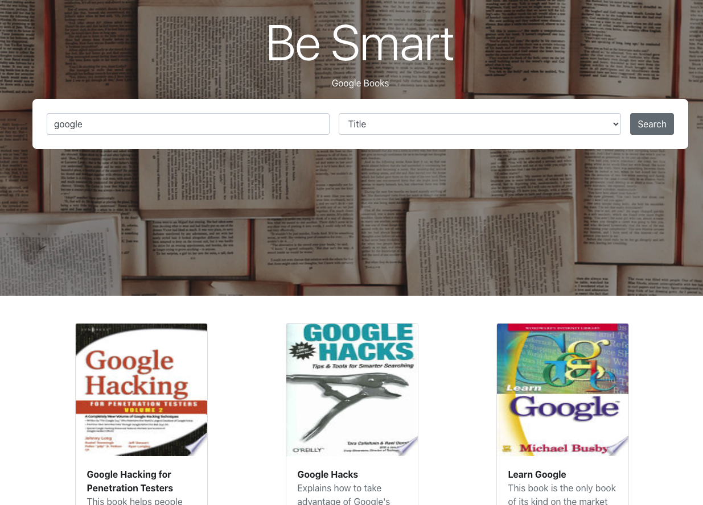

<h2> STX Next Library</h2>



## I developed Library web app using Google Books API based on React

## [Live Demo](https://stxnext-library.web.app/)

## Technologies

- [React](https://reactjs.org/)
- [React-Hooks](https://reactjs.org/docs/hooks-intro.html)
- [Fetch](https://developer.mozilla.org/en-US/docs/Web/API/Fetch_API/Using_Fetch)
- [Bootstrap](https://getbootstrap.com/)
- [Reactstrap](https://reactstrap.github.io/)
- [Styled-components](https://styled-components.com/)
- [React-Toastify](https://www.npmjs.com/package/react-toastify)
- [React-Truncate-Text](https://www.npmjs.com/package/react-text-truncate)
- [React-infinite-scroll-component](https://www.npmjs.com/package/react-infinite-scroll-component)
- [React-infinite-scroll-component](https://www.npmjs.com/package/react-infinite-scroll-component)
- [Jest](https://jestjs.io/)
- [Enzyme](https://www.npmjs.com/package/enzyme)
- [Firebase](https://firebase.google.com/)

#### First, Install deps

```bash
$ npm install
#or
$ yarn install
```

#### In the project directory, run the development server::

```bash
$ npm start
#or
$ yarn start
```

Open [http://localhost:3000](http://localhost:3000) with your browser to see the result.
